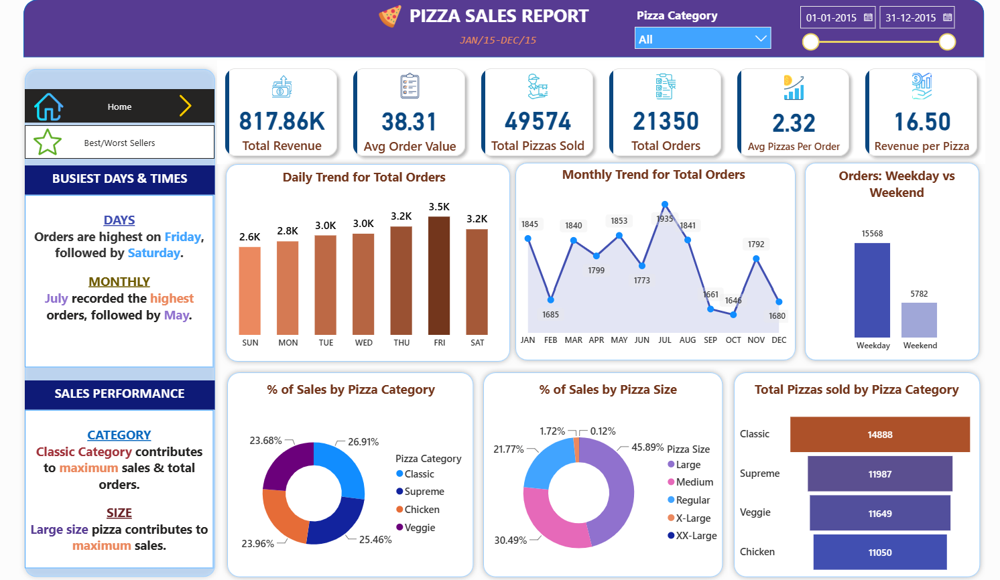
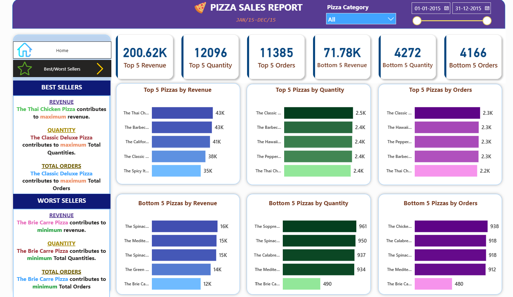

# Pizza Sales Analysis — SQL & Power BI

## Project Overview

Analyzed pizza sales data using SQL and Power BI to identify sales trends, product performance, and key business insights.

## Tools Used

- SQL
- Power BI
- Excel

## Key KPIs

- Total Revenue: 817.86K
- Total Orders: 21,350
- Total Pizzas Sold: 49,574
- Average Order Value: 38.31
- Average Pizzas per Order: 2.32
- Revenue per Pizza: 16.50

## Analysis Performed

- Analyzed daily and monthly order trends.
- Compared weekday and weekend orders.
- Analyzed sales contribution by pizza category and size.
- Identified top 5 and bottom 5 pizzas by revenue, quantity, and orders.
- Created additional analysis for revenue per pizza and weekday vs weekend orders.

## Dashboard

### Sales Overview

### Best & Worst Sellers

## Project Files

- `pizza_sales_analysis.sql` — SQL analysis queries
- `PIZZA SALES SQL QUERIES.docx` — SQL query documentation
- `pizza_sales_dashboard_home.png` — Sales overview dashboard
- `pizza_sales_dashboard_best_worst.png` — Best/worst seller dashboard

## Note

This project was completed as a hands-on learning project using a guided tutorial and was extended with additional analysis and KPIs.
